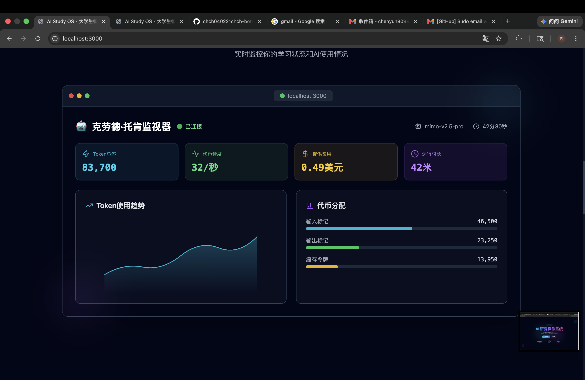
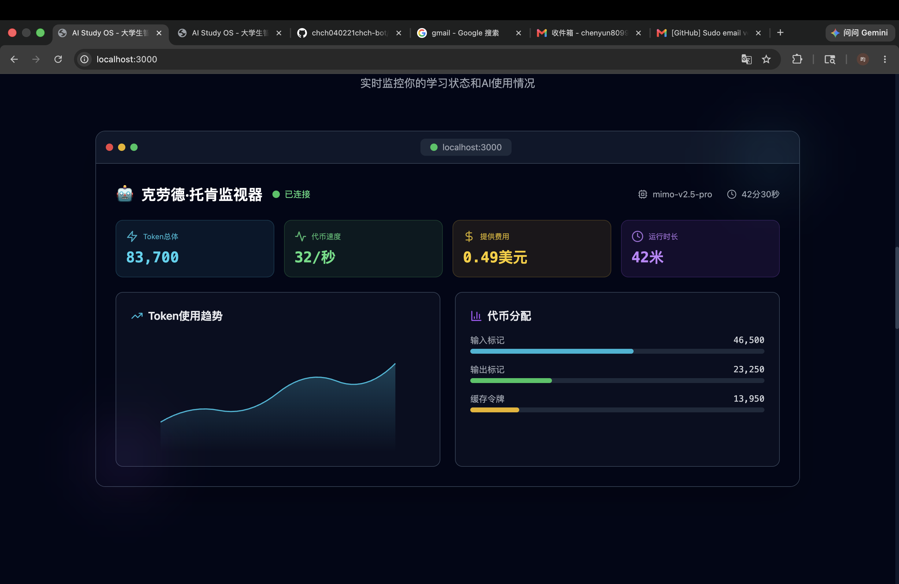
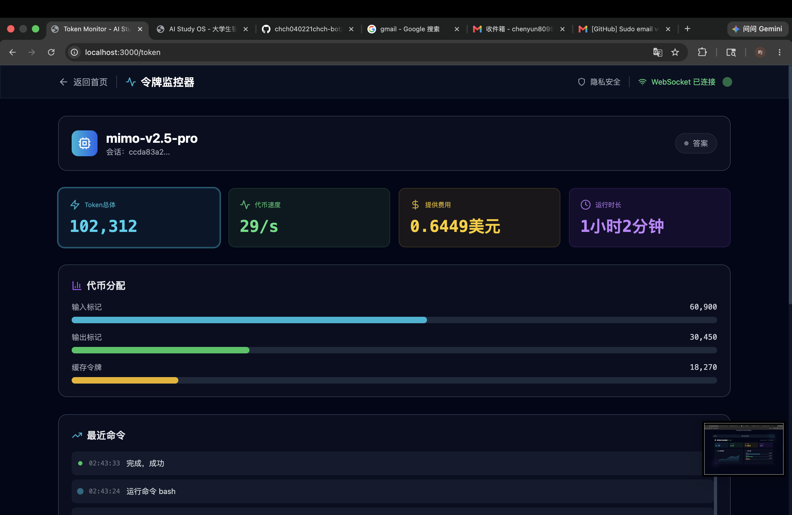

<div align="center">

# 🧠 AI Study OS

### *为大学生打造的下一代智能学习工作台*

[](LICENSE)
[](https://nextjs.org/)
[](https://tailwindcss.com/)
[](https://anthropic.com)

<br />

*实时监控 · 智能分析 · 本地优先*

[功能特性](#-功能特性) · [快速开始](#-快速开始) · [项目截图](#-项目截图) · [技术架构](#-技术架构) · [路线图](#-路线图)

</div>

---

## ✨ 功能特性

<table>
<tr>
<td width="50%">

### 📊 Token Monitor
实时监控 Claude Token 使用量
- Token 消耗统计
- 费用估算
- 速度监控
- WebSocket 实时同步

</td>
<td width="50%">

### 🤖 Agent Dashboard
Claude Agent 状态控制台
- 中英双语状态提示
- 9 种 AI 状态映射
- 实时任务追踪
- 命令历史记录

</td>
</tr>
<tr>
<td width="50%">

### 🔥 GitHub AI 热榜
追踪最新 AI 开源项目
- 实时热度排名
- Star 增长趋势
- 项目详情预览
- 快速跳转链接

</td>
<td width="50%">

### 🔒 隐私安全
本地优先的数据处理
- 零网络请求
- 只读访问
- 无凭据存储
- 100% 本地运行

</td>
</tr>
</table>

### 🌏 Claude 状态中文化

| 英文状态 | 中文提示 | 图标 |
|:---------|:---------|:----:|
| Thinking | 正在思考 | 🧠 |
| Thundering | 高强度推理中 | ⚡ |
| Hullaballooing | 多线程狂热分析中 | 🌀 |
| Writing | 正在编写代码 | ✍️ |
| Reading | 正在读取项目 | 📖 |
| Brewing | 正在酝酿方案 | ☕ |
| *未知状态* | *AI 正在自主运行中* | 🤖 |

---

## 🚀 快速开始

### 环境要求

- Node.js 18+
- npm 或 yarn
- Claude Code（用于数据采集）

### 安装步骤

```bash
# 1. 克隆仓库
git clone https://github.com/chch040221chch-bot/ai-study-os.git
cd ai-study-os

# 2. 安装依赖
npm install

# 3. 启动开发服务器
npm run dev

# 4. 访问应用
open http://localhost:3000
```

### 构建部署

```bash
# 构建生产版本
npm run build

# 启动生产服务器
npm start
```

---

## 📸 项目截图

<div align="center">

### 首页 Hero
<!-- 添加截图 -->


### Token Monitor
<!-- 添加截图 -->


### Agent Dashboard
<!-- 添加截图 -->


### GitHub AI 热榜
<!-- 添加截图 -->


</div>

> 💡 **提示**: 将截图放入 `docs/screenshots/` 目录即可显示

---

## 🏗️ 技术架构

```
┌─────────────────────────────────────────────────────────────┐
│                     AI Study OS                              │
├─────────────────────────────────────────────────────────────┤
│  Frontend Layer                                              │
│  ├── Next.js 14 (SSR/SSG)                                   │
│  ├── React 18 (UI Components)                               │
│  ├── Tailwind CSS (Styling)                                 │
│  └── Framer Motion (Animations)                            │
├─────────────────────────────────────────────────────────────┤
│  Data Layer                                                  │
│  ├── WebSocket (Real-time Sync)                             │
│  ├── Claude Collector (Local Data)                          │
│  └── Status Map (i18n)                                      │
├─────────────────────────────────────────────────────────────┤
│  Infrastructure                                              │
│  ├── Node.js Server                                         │
│  ├── Local File System                                      │
│  └── ~/.claude/ Directory                                   │
└─────────────────────────────────────────────────────────────┘
```

### 项目结构

```
ai-study-os/
├── 📁 components/           # React 组件
│   ├── AgentStatus.js       # Agent 状态面板
│   ├── TokenMonitor.js      # Token 监控
│   ├── GitHubTrending.js    # GitHub 热榜
│   └── ...
├── 📁 lib/                  # 工具库
│   ├── claude-collector.js  # 数据采集
│   └── claude-status-map.js # 状态映射
├── 📁 pages/                # 页面路由
├── 📁 hooks/                # React Hooks
├── 📁 styles/               # 全局样式
└── server.js                # 自定义服务器
```

---

## 🗺️ 路线图

### v1.0 - 已完成 ✅
- [x] 首页展示
- [x] Token Monitor
- [x] Agent Dashboard
- [x] GitHub AI 热榜
- [x] Claude 状态中文化
- [x] 隐私安全页

### v1.1 - 进行中 🚧
- [ ] 数据持久化（Token 历史记录）
- [ ] 响应式优化（移动端适配）
- [ ] 深色/浅色主题切换
- [ ] WebSocket 断线重连

### v2.0 - 计划中 📋
- [ ] 多模型支持（GPT、Gemini）
- [ ] 自定义仪表盘布局
- [ ] 数据导出功能
- [ ] 插件系统

### v3.0 - 未来愿景 🔮
- [ ] AI 对话集成
- [ ] 团队协作功能
- [ ] 云端同步
- [ ] 移动端 App

---

## 🤝 贡献

欢迎贡献！请查看 [CONTRIBUTING.md](CONTRIBUTING.md) 了解详情。

```bash
# Fork 仓库
# 创建功能分支
git checkout -b feature/amazing-feature

# 提交更改
git commit -m 'Add amazing feature'

# 推送分支
git push origin feature/amazing-feature

# 创建 Pull Request
```

---

## 📄 许可证

本项目基于 MIT 许可证开源 - 查看 [LICENSE](LICENSE) 文件了解详情

---

## 🙏 致谢

- [Next.js](https://nextjs.org/) - React 框架
- [Tailwind CSS](https://tailwindcss.com/) - 样式方案
- [Framer Motion](https://www.framer.com/motion/) - 动画库
- [Lucide](https://lucide.dev/) - 图标库
- [Anthropic](https://anthropic.com/) - Claude AI

---

<div align="center">

**AI Study OS** © 2024 · Built with ❤️ for students

*本地优先 · 隐私安全 · 智能高效*

</div>
